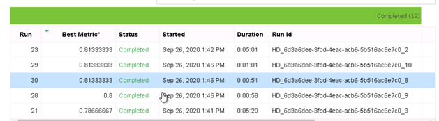
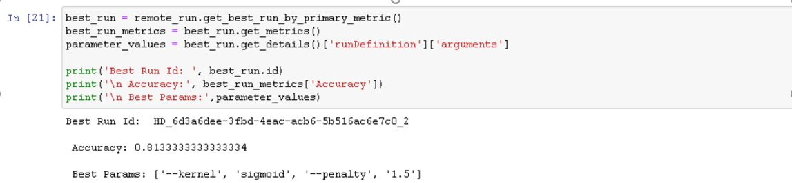
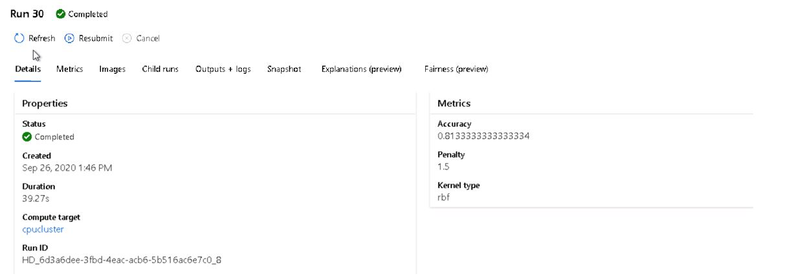
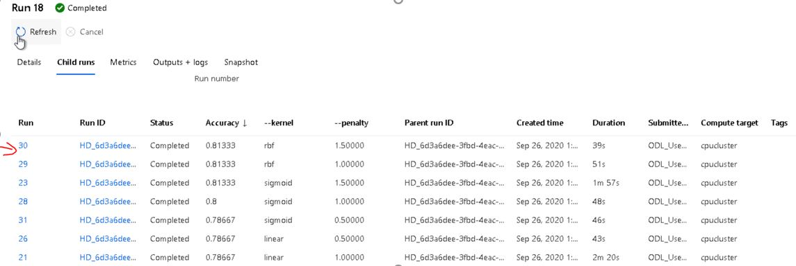
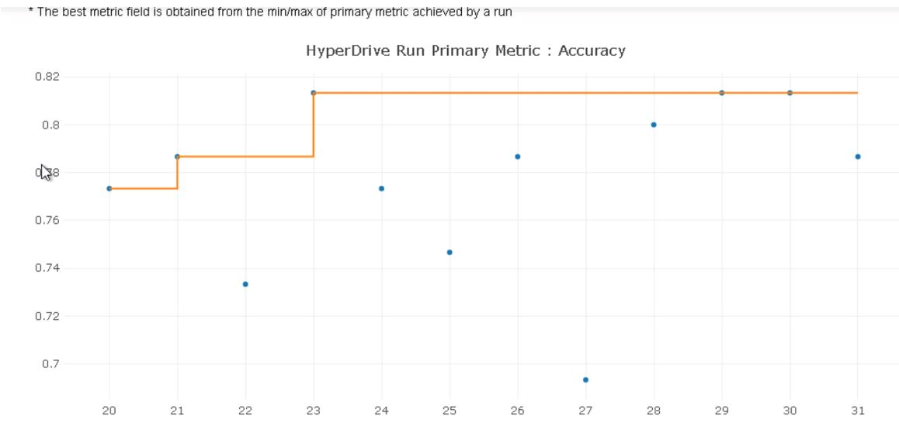

*NOTE:* This file is a template that you can use to create the README for your project. The *TODO* comments below will highlight the information you should be sure to include.

# Heart Failure Prediction Capstone Project 

This project leverages AutoML and Hyperdrive capabilities of Azure ML platform to build and deploy Heart Failure death event prediction classification model. Project soure is from kaggle competition [Heart Failure Prediction](https://www.kaggle.com/andrewmvd/heart-failure-clinical-data). This project will demonstrate ability to use an external dataset in your workspace, train a model using the different tools available in the AzureML framework as well as ability to deploy the model as a web service. Results from both approachs(automl and hyperdrive) will be compared and best chosen model will be deployed using python SDK for Azure ML.  

## Project Set Up and Installation
Following steps are required to setup the project in Azure ML platform:
1. Create the new workspace in Azure ML studio. 
2. Then create the compute instance VM to run the jupyter notebook instance. 
3. Launch the jupyter node once the instance is available. 
4. In jupyter notebook workspace uploads all the starter files from gitrepo. Starter files include ipynb files for automl and hyperdrive, script files for model training/deployment and dataset csv file downloaded from kaggle [link](https://www.kaggle.com/andrewmvd/heart-failure-clinical-data/download).
5. Upload and register the dataset in Azure ML workspace.   


## Dataset

### Overview
Cardiovascular diseases (CVDs) are the number 1 cause of death globally, taking an estimated 17.9 million lives each year, which accounts for 31% of all deaths worlwide. Heart failure is a common event caused by CVDs and this dataset contains 12 features that can be used to predict mortality by heart failure.

Most cardiovascular diseases can be prevented by addressing behavioural risk factors such as tobacco use, unhealthy diet and obesity, physical inactivity and harmful use of alcohol using population-wide strategies.

People with cardiovascular disease or who are at high cardiovascular risk (due to the presence of one or more risk factors such as hypertension, diabetes, hyperlipidaemia or already established disease) need early detection and management wherein a machine learning model can be of great help.

Dataset is provided by Davide Chicco and Giuseppe Jurman.Further information on this dataset can be referred at BMC Medical Informatics and Decision Making 20, 16 (2020) [link](https://bmcmedinformdecismak.biomedcentral.com/articles/10.1186/s12911-020-1023-5)

### Task
This is supervised binary classification problem. Task is built and train model given the input features to predict the event of death if there is an heart failure. Target feature DEATH_EVENT has binary outcome (0/1) label. There are 12 feature for each medical case. All features are numeric representation either integer or decimal data types. Size of dataset is 299 cases and its slightly skewed towards 0 outcome (203/299).     

### Access
To access the dataset it should be registered into workspace with keyname.

For Auto experiment, dataset can be accessed using below code implementation: 
```
ws = Workspace.from_config()

key = "Heart-Failure"

if key in ws.datasets.keys(): 
        dataset = ws.datasets[key] 
```        
First the workspace is returned using from_config() method. Then registered key should be lookup into dataset list to retrieved the dataset reference. 

For hyperdrive experiment, dataset is accessed using below code implementation in train.py script file: 
```
from azureml.core.run import Run
from azureml.core.dataset import Dataset

run = Run.get_context()
ws = run.experiment.workspace
heart_dataset = Dataset.get_by_name(workspace=ws, name='Heart-Failure')
```
From the run context, reference to experiment running under workspace is returned. Then dataset get_by_name method returns the reference to dataset when workspace and dataset name is passed as arguments. 

## Automated ML
*TODO*: Give an overview of the `automl` settings and configuration you used for this experiment

### Results
*TODO*: What are the results you got with your automated ML model? What were the parameters of the model? How could you have improved it?

*TODO* Remeber to provide screenshots of the `RunDetails` widget as well as a screenshot of the best model trained with it's parameters.

## Hyperparameter Tuning
*TODO*: What kind of model did you choose for this experiment and why? Give an overview of the types of parameters and their ranges used for the hyperparameter search

Support Vector classifier from SKLearn library is chosen for this task. SVC is good classifier for binary classification task when input feature space has many dimensions. SVC provides different kernel like rbf, poly, linear etc which can classify sample data in high dimensional space with many features and can map inherent complexities in data. Since we don't know beforehand if data will be seperable in linear dimensional space or requries rbf kernal to map high complexities, this is where benefit of SVC is leveraged as it can trained on range of kernel values as hyperparameter. Penalty parameter can be added as regularisation term to reduce overfitting in training process. 

I came with up two sets of hyperparameter ranges for tunning job listed below: 

- penalty(C:float, default=1.0) - Regularization parameter. The strength of the regularization is inversely proportional to C. Must be strictly positive. The penalty is a squared l2 penalty.

- kernel - {‘linear’, ‘poly’, ‘rbf’, ‘sigmoid’, ‘precomputed’}, default=’rbf’ Specifies the kernel type to be used in the algorithm. It must be one of ‘linear’, ‘poly’, ‘rbf’, ‘sigmoid’, ‘precomputed’ or a callable. If none is given, ‘rbf’ will be used. If a callable is given it is used to pre-compute the kernel matrix from data matrices; that matrix should be an array of shape (n_samples, n_samples).


### Results
With Accuracy as primary evaluation metric and goal to maximize the primary metric hyperparameter tunning job was configured with sets of parameters ranges listed below: 

- Kernel - 'linear', 'rbf', 'poly', 'sigmoid'
- penalty - 0.5, 1, 1.5

These parameter range covers all combinations from mapping simple model to highly complex model. 

Below snapshot shows the output from `RunDetails` widget. 


Below snapshot shows the best model trained with highest Accuracy of 0.81333 and hyper parameter configuration for the best run. 



Additional snapshots from Azure ML studio: 



Listed below are some of the suggested improvements: 
1. Model can be further improved by adding more hyperparameters like gamma and probability with suitable range of values. 
2. kfold cross validation can be added to validate the robustness of model. 
3. There is scope to increase the size of training data. Adding more data can build more preditable and efficient model. 

## Model Deployment
*TODO*: Give an overview of the deployed model and instructions on how to query the endpoint with a sample input.

## Screen Recording
*TODO* Provide a link to a screen recording of the project in action. Remember that the screencast should demonstrate:
- A working model
- Demo of the deployed  model
- Demo of a sample request sent to the endpoint and its response

## Standout Suggestions
*TODO (Optional):* This is where you can provide information about any standout suggestions that you have attempted.