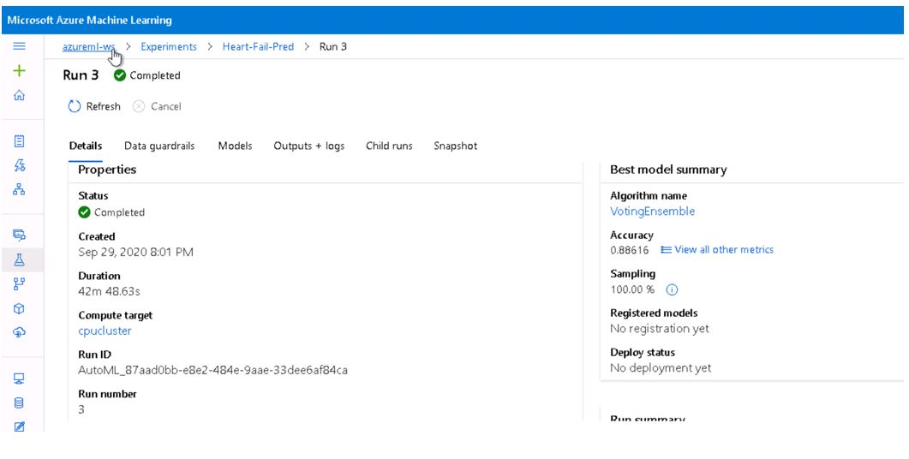

# Heart Failure Prediction Capstone Project 

This project leverages AutoML and Hyperdrive capabilities of Azure ML platform to build and deploy Heart Failure death event prediction classification model. Project soure is from kaggle competition [Heart Failure Prediction](https://www.kaggle.com/andrewmvd/heart-failure-clinical-data). This project will demonstrate ability to use an external dataset in your workspace, train a model using the different tools available in the AzureML framework as well as ability to deploy the model as a web service. Results from both approachs(automl and hyperdrive) will be compared and best chosen model will be deployed using python SDK for Azure ML.  

## Project Set Up and Installation
Following steps are required to setup the project in Azure ML platform:
1. Create the new workspace in Azure ML studio. 
2. Then create the compute instance VM to run the jupyter notebook instance. 
3. Launch the jupyter node once the instance is available. 
4. In jupyter notebook workspace uploads all the starter files from gitrepo. Starter files include ipynb files for automl and hyperdrive, script files for model training/deployment and dataset csv file downloaded from kaggle [link](https://www.kaggle.com/andrewmvd/heart-failure-clinical-data/download).
5. Upload and register the dataset in Azure ML workspace.   


## Dataset

### Overview
Cardiovascular diseases (CVDs) are the number 1 cause of death globally, taking an estimated 17.9 million lives each year, which accounts for 31% of all deaths worlwide. Heart failure is a common event caused by CVDs and this dataset contains 12 features that can be used to predict mortality by heart failure.

Most cardiovascular diseases can be prevented by addressing behavioural risk factors such as tobacco use, unhealthy diet and obesity, physical inactivity and harmful use of alcohol using population-wide strategies.

People with cardiovascular disease or who are at high cardiovascular risk (due to the presence of one or more risk factors such as hypertension, diabetes, hyperlipidaemia or already established disease) need early detection and management wherein a machine learning model can be of great help.

Dataset is provided by Davide Chicco and Giuseppe Jurman.Further information on this dataset can be referred at BMC Medical Informatics and Decision Making 20, 16 (2020) [link](https://bmcmedinformdecismak.biomedcentral.com/articles/10.1186/s12911-020-1023-5)

### Task
This is supervised binary classification problem. Task is built and train model given the input features to predict the event of death if there is an heart failure. Target feature DEATH_EVENT has binary outcome (0/1) label. There are 12 feature for each medical case. All features are numeric representation either integer or decimal data types. Size of dataset is 299 cases and its slightly skewed towards 0 outcome (203/299).     

### Access
To access the dataset it should be registered into workspace with keyname.

For Auto experiment, dataset can be accessed using below code implementation: 
```
ws = Workspace.from_config()

key = "Heart-Failure"

if key in ws.datasets.keys(): 
        dataset = ws.datasets[key] 
```        
First the workspace is returned using from_config() method. Then registered key should be lookup into dataset list to retrieved the dataset reference. 

For hyperdrive experiment, dataset is accessed using below code implementation in train.py script file: 
```
from azureml.core.run import Run
from azureml.core.dataset import Dataset

run = Run.get_context()
ws = run.experiment.workspace
heart_dataset = Dataset.get_by_name(workspace=ws, name='Heart-Failure')
```
From the run context, reference to experiment running under workspace is returned. Then dataset get_by_name method returns the reference to dataset when workspace and dataset name is passed as arguments. 

## Automated ML

AutoML settings represents the configuration for submitting an automated ML experiment in Azure Machine Learning. This configuration object contains and persists the parameters for configuring the experiment run, as well as the training data to be used at run time. 

Configuration used for this experiments are discussed below:

- experiment_timeout_minutes: Its an exit criteria in settings to define how long, in minutes, experiment should continue to run. To help avoid experiment time out failures, there is a minimum of 15 minutes, or 60 minutes if your row by column size exceeds 10 million. I have set it to 20mins for this automl run.

- max_concurrent_iterations:  Represents the maximum number of iterations that would be executed in parallel. The default value is 1. In this configuration I have set it to 4 as it should be less than or equal to the maximum number of nodes. Otherwise, runs will be queued until nodes are available.

- primary_metric: The metric that Automated Machine Learning will optimize for model selection. In this setting we have used Accuracy as primary metric. Also its a default metric for classification task. 

- n_cross_validations: Specifies how many cross validations to perform when user validation data is not specified. In this setting we have used 5 to represent 5-fold cross validation. It further validates the robustness of model. 

- featurization: Represents 'auto' / 'off' / FeaturizationConfig Indicator for whether featurization step should be done automatically or not, or whether customized featurization should be used. In this setting we have set it to 'auto'. Column type is automatically detected. Based on the detected column type preprocessing/featurization is done as follows:
    - Categorical: Target encoding, one hot encoding, drop high cardinality categories, impute missing values.
    - Numeric: Impute missing values, cluster distance, weight of evidence.
    - DateTime: Several features such as day, seconds, minutes, hours etc.
    - Text: Bag of words, pre-trained Word embedding, text target encoding.

- task: The type of task to run. Values can be 'classification', 'regression', or 'forecasting' depending on the type of automated ML problem to solve. In this setting we have set it to 'classification' task. 

- training_data: The training data to be used within the experiment. It should contain both training features and a label column (optionally a sample weights column). If training_data is specified, then the label_column_name parameter must also be specified.

- label_column_name: The name of the label column. If the input data is from a pandas. DataFrame which doesn't have column names, column indices can be used instead, expressed as integers.

- debug_log: The log file to write debug information to. If not specified, 'automl.log' is used.

### Results

With Accuracy as primary evaluation metric and goal to maximize the primary metric automl job was configured with automl_settings and AutoMLConfig settings as shown below:
```
automl_settings = {
    "experiment_timeout_minutes": 20,
    "max_concurrent_iterations": 4,
    "primary_metric" : 'Accuracy',
    "n_cross_validations": 5,
    "featurization": 'auto'
}

automl_config = AutoMLConfig(task = "classification",
                             training_data=dataset,
                             label_column_name="DEATH_EVENT",   
                             debug_log = "automl_errors.log",
                             **automl_settings)
```

Below snapshot shows the output from `RunDetails` widget. 


Best model is retrieved by calling get_output() on experiment as shown below:


Best model weights is saved using joblib.dump as shown below:


**Best AutoML run has accuracy score of 0.88616**


Listed below are some of the suggested improvements: 
1. We can remove the experiment_time_out settings from configuration and set the enable_early_stopping=True. This would allow model to train for atleast 20 iterations and training continues until no improvement in primary metric is recorded for n iterations as configured. 
2. With GPU enabled cluster compute number of iteration can be increased so that total number of different algorithm and parameter combinations can be tested during an automated ML experiment. This would further improve the accuracy score. 
3. Using experiment_exit_score in exit criteria completes the experiment after a specified primary metric score has been reached. This way desired metric score can be achieved.  

## Hyperparameter Tuning

Support Vector classifier from SKLearn library is chosen for this task. SVC is good classifier for binary classification task when input feature space has many dimensions. SVC provides different kernel like rbf, poly, linear etc which can classify sample data in high dimensional space with many features and can map inherent complexities in data. Since we don't know beforehand if data will be seperable in linear dimensional space or requries rbf kernal to map high complexities, this is where benefit of SVC is leveraged as it can trained on range of kernel values as hyperparameter. Penalty parameter can be added as regularisation term to reduce overfitting in training process. 

I came with up two sets of hyperparameter ranges for tunning job listed below: 

- penalty(C:float, default=1.0) - Regularization parameter. The strength of the regularization is inversely proportional to C. Must be strictly positive. The penalty is a squared l2 penalty.

- kernel - ('linear', 'poly', 'rbf', 'sigmoid', 'precomputed'), default='rbf' Specifies the kernel type to be used in the algorithm. It must be one of 'linear', 'poly', 'rbf', 'sigmoid', 'precomputed' or a callable. If none is given, 'rbf' will be used. If a callable is given it is used to pre-compute the kernel matrix from data matrices; that matrix should be an array of shape (n_samples, n_samples).


### Results
With Accuracy as primary evaluation metric and goal to maximize the primary metric hyperparameter tunning job was configured with sets of parameters ranges listed below: 

- Kernel - 'linear', 'rbf', 'poly', 'sigmoid'
- penalty - 0.5, 1, 1.5

These parameter range covers all combinations from mapping simple model to highly complex model. 

Below snapshot shows the output from `RunDetails` widget. 


**Below snapshot shows the best model trained with highest Accuracy of 0.81333 and hyper parameter configuration for the best run.** 


Additional snapshots from Azure ML studio: 


Listed below are some of the suggested improvements: 
1. Model can be further improved by adding more hyperparameters like gamma and probability with suitable range of values. 
2. kfold cross validation can be added to validate the robustness of model. 
3. There is scope to increase the size of training data. Adding more data can build more preditable and efficient model. 

## Model Deployment
From both the experiments AutoML and Hyperdive we can observe the accuracy score of AutoML is significantly much better compared to accuracy score of Hyperdrive. Given that we decide to choose best Auto ML model for further deployment. 

    Auto ML Accuracy score - 0.88616
    Hyperdrive Accuracy score - 0.81333  

Model is deployed as webservice on local machine so that its eaiser to debug and test the results. Below workflow is similar no matter where the model is deployed. 

- Register the model: A registered model is a logical container for one or more files that make up model. Model weight file, name and workspace reference is passed to register function to register the model with version number.   
```
model = Model.register(model_path="best-trained-model.pkl",
                       model_name="best-trained-model",
                       workspace = ws)
```                       

- Prepare an inference configuration: An inference configuration describes how to set up the web-service containing model. It's used later, when we deploy the model. Script entry file and curated environment from your workspace is configured. The AzureML-Tutorial environment contains common data science packages. These packages include Scikit-Learn, Pandas, Matplotlib, and a larger set of azureml-sdk packages.
```
env = Environment.get(workspace=ws, name="AzureML-Tutorial")
inference_config = InferenceConfig(entry_script='score.py', environment=env)
```

- Prepare an entry script: The entry script receives data submitted to a deployed web service and passes it to the model. It then takes the response returned by the model and returns that to the client. The two things we have  accomplish in entry script are:
    - Loading your model (using a function called init())
    - Running your model on input data (using a function called run())

- Choose a compute target: The deployment configuration is specific to the compute target that will host the web service. We have used local instance to deploy the model at port=6789
```
deployment_conf = LocalWebservice.deploy_configuration(port=6789)
```

- Deploy the model to the compute target: Finally model is deployed with these settings as shown below: 
```
service = Model.deploy(workspace=ws,
                          name=service_name,
                          models=[model],
                          inference_config=inference_config,
                          deployment_config=deployment_conf)
```

- Test the resulting web service: Deploying an Azure Machine Learning model as a web service creates a REST API endpoint. We can than send data to this endpoint and receive the prediction returned by the model. The REST API expects the body of the request to be a JSON document with the following structure:
```
{
    "data":
        [
            <model-specific-data-structure>
        ]
}
```
In the header section of Rest API we specify the format of body which is 'application/json' content and scoring uril is retrieved from **service.scoring_uri**. 
These arguments are send to Rest API post request and response is returned in JSON format. 
```
resp = requests.post(scoring_uri, input_data, headers=headers)
```

###Logging and Cleanup

Logs are retrieved and displayed for endpoint API calls using **service.get_logs()** method. 
```
logs = service.get_logs()

for line in logs.split('\n'):
    print(line)
```

After usage deployed webservice is deleted. 
```
service.delete(delete_cache=True, delete_image=False, delete_volume=True)
``` 


## Screen Recording
*TODO* Provide a link to a screen recording of the project in action. Remember that the screencast should demonstrate:
- A working model
- Demo of the deployed  model
- Demo of a sample request sent to the endpoint and its response

## Standout Suggestions
*TODO (Optional):* This is where you can provide information about any standout suggestions that you have attempted.
